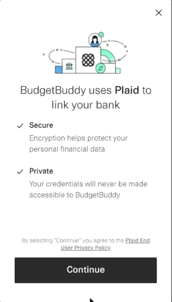
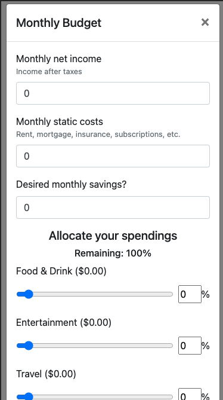
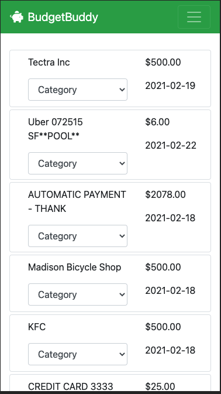
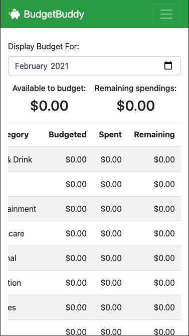

# BudgetBuddy

BudgetBuddy is a full-stack budgeting web application that allows user to easily set up and track their budget

[Live Demo](https://budgetbuddy-app.herokuapp.com/)

## Current Features 

* User can input budget information (monthly income, static costs, how much they wish to save, 
  and the portion of their income that they would like to allocate to each category)
* User can connect to their bank account
* User can select which months budget they would like to view
* User can view a table of their overall budget information for the current month. 
* User can view how much money they have left to budget
* User can view the amount of spending they have remaining before going over budget.
* User can track account balances for their connected bank
* User can track their bank transactions that have occured in the last 30 days
* User can categorize their bank transactions to have them deducted from their budget

## Planned Additions

* Users can view a chart of their budgeted spendings vs. their actual spendings
* User can view articles that offer advice on financial planning and saving

## Screenshots

